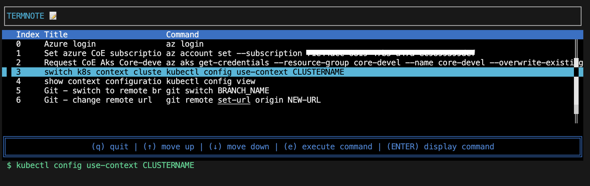

# Termnote

Simple terminal CLI tool to manage your terminal commands or urls which you can saved as notes and searching for them



## Usage Commands

```bash
A terminal CLI tool to note the commands you run

Usage: termnote [COMMAND]

Commands:
  add     Add a new command to the list
  update  Update a noted command
  remove  Remove a noted command by title or index
  search  Search commands by title or description
  list    List all noted commands
  url     Link notes
  help    Print this message or the help of the given subcommand(s)

Options:
  -h, --help  Print help
```

## Usage Links

```bash
Link notes

Usage: termnote url [COMMAND]

Commands:
  list    List all noted links
  add     Add a new link to the list
  update  Update a noted link
  remove  Remove a noted link by title or index
  search  Search links by title
  help    Print this message or the help of the given subcommand(s)

Options:
  -h, --help  Print help
```

## Development

**Compilation**:

```bash
cargo build --release
```

**Test your build**:

```bash
./target/debug/tn list
```

On default termnote is creating a ~/.termnote/db.json file in your home directory if not exists

**Installation**:

after the compilation move the binary ./target/release/termnote to /bin folder of your OS

**Supported OS**:

* MAC OSX
* Linux
